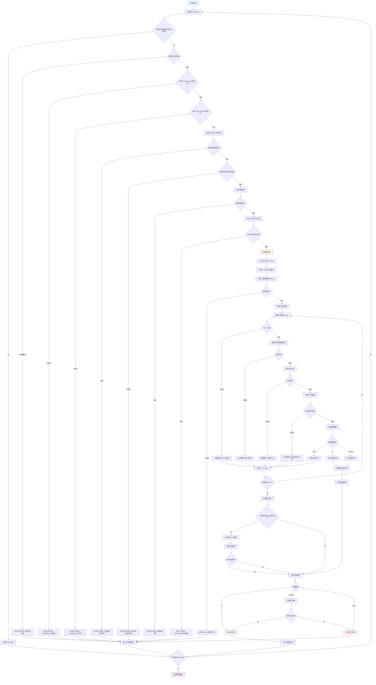

# Kueue 预选（Nominate）阶段详细流程

## 预选阶段流程图



## 示例 YAML 配置

### 1. 工作负载示例 (Job)

```yaml
apiVersion: batch/v1
kind: Job
metadata:
  namespace: ml-training
  name: tensorflow-training-job
  labels:
    kueue.x-k8s.io/queue-name: ml-queue
    kueue.x-k8s.io/priority-class: high-priority
spec:
  parallelism: 4
  completions: 4
  suspend: true
  template:
    metadata:
      annotations:
        kueue.x-k8s.io/priority: "100"
    spec:
      nodeSelector:
        node-type: gpu
      tolerations:
      - key: "nvidia.com/gpu"
        operator: "Exists"
        effect: "NoSchedule"
      containers:
      - name: trainer
        image: tensorflow/tensorflow:2.8.0-gpu
        command: ["python", "train.py"]
        resources:
          requests:
            cpu: 2
            memory: 8Gi
            nvidia.com/gpu: 1
          limits:
            cpu: 2
            memory: 8Gi
            nvidia.com/gpu: 1
      restartPolicy: Never
```

### 2. 资源 Flavor 示例

```yaml
apiVersion: kueue.x-k8s.io/v1beta1
kind: ResourceFlavor
metadata:
  name: gpu-flavor
spec:
  nodeLabels:
    node-type: gpu
    gpu-vendor: nvidia
  nodeTaints:
  - key: "nvidia.com/gpu"
    operator: "Exists"
    effect: "NoSchedule"
  tolerations:
  - key: "nvidia.com/gpu"
    operator: "Exists"
    effect: "NoSchedule"
---
apiVersion: kueue.x-k8s.io/v1beta1
kind: ResourceFlavor
metadata:
  name: cpu-flavor
spec:
  nodeLabels:
    node-type: cpu
  nodeTaints: []
```

### 3. 集群队列示例

```yaml
apiVersion: kueue.x-k8s.io/v1beta1
kind: ClusterQueue
metadata:
  name: ml-cluster-queue
spec:
  namespaceSelector:
    matchLabels:
      workload-type: ml
  resourceGroups:
  - coveredResources: ["cpu", "memory"]
    flavors:
    - name: cpu-flavor
      resources:
      - name: "cpu"
        nominalQuota: 20
        borrowingLimit: 10
      - name: "memory"
        nominalQuota: 80Gi
        borrowingLimit: 40Gi
  - coveredResources: ["nvidia.com/gpu"]
    flavors:
    - name: gpu-flavor
      resources:
      - name: "nvidia.com/gpu"
        nominalQuota: 8
        borrowingLimit: 4
  preemption:
    withinClusterQueue: LowerPriority
    reclaimWithinCohort: LowerPriority
    borrowWithinCohort: LowerPriority
```

### 4. 本地队列示例

```yaml
apiVersion: kueue.x-k8s.io/v1beta1
kind: LocalQueue
metadata:
  namespace: ml-training
  name: ml-queue
spec:
  clusterQueue: ml-cluster-queue
```

### 5. 命名空间示例

```yaml
apiVersion: v1
kind: Namespace
metadata:
  name: ml-training
  labels:
    workload-type: ml
    environment: production
```

## 预选阶段详细说明

### 1. 基础验证阶段

#### 1.1 缓存检查

```go
if !workload.NeedsSecondPass(w.Obj) && s.cache.IsAssumedOrAdmittedWorkload(w) {
    // 跳过已经在缓存中且不需要二次调度的 workload
    continue
}
```

- **目的**: 避免重复处理已经调度的工作负载
- **条件**: 工作负载已在缓存中且不需要二次调度

#### 1.2 准入检查状态验证

```go
if workload.HasRetryChecks(w.Obj) || workload.HasRejectedChecks(w.Obj) {
    e.inadmissibleMsg = "The workload has failed admission checks"
}
```

- **目的**: 检查工作负载的准入检查状态
- **失败条件**: 有重试检查或拒绝检查

#### 1.3 ClusterQueue 状态检查

```go
if snap.InactiveClusterQueueSets.Has(w.ClusterQueue) {
    e.inadmissibleMsg = fmt.Sprintf("ClusterQueue %s is inactive", w.ClusterQueue)
}
```

- **目的**: 确保目标 ClusterQueue 处于活跃状态
- **失败条件**: ClusterQueue 被标记为非活跃

#### 1.4 ClusterQueue 存在性检查

```go
if e.clusterQueueSnapshot == nil {
    e.inadmissibleMsg = fmt.Sprintf("ClusterQueue %s not found", w.ClusterQueue)
}
```

- **目的**: 验证 ClusterQueue 是否存在
- **失败条件**: 无法找到对应的 ClusterQueue

#### 1.5 命名空间验证

```go
if err := s.client.Get(ctx, types.NamespacedName{Name: w.Obj.Namespace}, &ns); err != nil {
    e.inadmissibleMsg = fmt.Sprintf("Could not obtain workload namespace: %v", err)
}
```

- **目的**: 获取工作负载所在的命名空间信息
- **失败条件**: 无法获取命名空间

#### 1.6 命名空间标签匹配

```go
if !e.clusterQueueSnapshot.NamespaceSelector.Matches(labels.Set(ns.Labels)) {
    e.inadmissibleMsg = fmt.Sprintf("Workload [%v/%v] namespace labels [%v] doesn't match ClusterQueue [%v] selector [%v]",
        w.Obj.Namespace, w.Obj.Name, labels.Set(ns.Labels),
        e.clusterQueueSnapshot.Name, e.clusterQueueSnapshot.NamespaceSelector)
}
```

- **目的**: 确保工作负载的命名空间标签匹配 ClusterQueue 的选择器
- **示例**: 命名空间需要包含 `workload-type: ml` 标签才能使用 `ml-cluster-queue`

#### 1.7 资源验证

```go
if err := workload.ValidateResources(&w); err != nil {
    e.inadmissibleMsg = fmt.Sprintf("%s: %v", errInvalidWLResources, err.ToAggregate())
}
```

- **目的**: 验证工作负载的资源请求是否有效
- **检查项目**: 资源名称、数量、格式等

#### 1.8 LimitRange 约束验证

```go
if err := workload.ValidateLimitRange(ctx, s.client, &w); err != nil {
    e.inadmissibleMsg = fmt.Sprintf("%s: %v", errLimitRangeConstraintsUnsatisfiedResources, err.ToAggregate())
}
```

- **目的**: 验证资源请求是否满足命名空间的 LimitRange 约束
- **检查项目**: CPU、内存等资源的上下限

### 2. 资源分配阶段

#### 2.1 FlavorAssigner 初始化

```go
flvAssigner := flavorassigner.New(wl, cq, snap.ResourceFlavors, s.fairSharing.Enable, preemption.NewOracle(s.preemptor, snap))
```

- **参数**:
  - `wl`: 工作负载信息
  - `cq`: ClusterQueue 快照
  - `snap.ResourceFlavors`: 可用的资源 Flavor
  - `s.fairSharing.Enable`: 是否启用公平共享
  - `preemption.NewOracle`: 抢占预言机

#### 2.2 为每个 PodSet 分配资源

```go
for i, podSet := range requests {
    psAssignment := PodSetAssignment{
        Name:     podSet.Name,
        Flavors:  make(ResourceAssignment, len(podSet.Requests)),
        Requests: podSet.Requests.ToResourceList(),
        Count:    podSet.Count,
    }
}
```

- **目的**: 为工作负载中的每个 PodSet 分配资源
- **PodSet**: 具有相同资源需求的 Pod 集合

#### 2.3 为每个资源类型查找 Flavor

```go
for resName := range podSet.Requests {
    flavors, status := a.findFlavorForPodSetResource(log, i, podSet.Requests, resName, assignment.Usage.Quota)
}
```

#### 2.4 资源组检查

```go
resourceGroup := a.cq.RGByResource(resName)
if resourceGroup == nil {
    return nil, &Status{
        reasons: []string{fmt.Sprintf("resource %s unavailable in ClusterQueue", resName)},
    }
}
```

- **目的**: 检查 ClusterQueue 是否支持该资源类型
- **失败条件**: 资源类型不在任何资源组中

#### 2.5 节点选择器创建

```go
selector := flavorSelector(podSpec, resourceGroup.LabelKeys)
```

- **目的**: 根据 Pod 的 nodeSelector 和 nodeAffinity 创建选择器
- **用途**: 后续匹配 Flavor 的节点标签

#### 2.6 Flavor 遍历和匹配

```go
for ; idx < len(resourceGroup.Flavors); idx++ {
    fName := resourceGroup.Flavors[idx]
    flavor, exist := a.resourceFlavors[fName]
}
```

- **目的**: 遍历资源组中的所有 Flavor
- **顺序**: 按照 ClusterQueue 中定义的顺序

#### 2.7 拓扑感知调度检查

```go
if features.Enabled(features.TopologyAwareScheduling) {
    if message := checkPodSetAndFlavorMatchForTAS(a.cq, ps, flavor); message != nil {
        log.Error(nil, *message)
        status.appendf("%s", *message)
        continue
    }
}
```

- **目的**: 检查 PodSet 和 Flavor 是否匹配拓扑感知调度要求
- **失败条件**: 拓扑约束不匹配

#### 2.8 污点容忍检查

```go
taint, untolerated := corev1helpers.FindMatchingUntoleratedTaint(flavor.Spec.NodeTaints, append(podSpec.Tolerations, flavor.Spec.Tolerations...), func(t *corev1.Taint) bool {
    return t.Effect == corev1.TaintEffectNoSchedule || t.Effect == corev1.TaintEffectNoExecute
})
```

- **目的**: 检查 Pod 是否能容忍 Flavor 节点上的污点
- **考虑因素**: Pod 自身的 tolerations 和 Flavor 提供的额外 tolerations

#### 2.9 节点亲和性检查

```go
if match, err := selector.Match(&corev1.Node{ObjectMeta: metav1.ObjectMeta{Labels: flavor.Spec.NodeLabels}}); !match || err != nil {
    status.appendf("flavor %s doesn't match node affinity", fName)
    continue
}
```

- **目的**: 检查 Flavor 的节点标签是否匹配 Pod 的节点选择器
- **匹配条件**: nodeSelector 和 nodeAffinity 都匹配

#### 2.10 资源配额检查

```go
for rName, val := range requests {
    resQuota := a.cq.QuotaFor(resources.FlavorResource{Flavor: fName, Resource: rName})
    mode, borrow, s := a.fitsResourceQuota(log, fr, val+assignmentUsage[fr], resQuota)
}
```

- **目的**: 检查 Flavor 是否有足够的资源配额
- **分配模式**:
  - **Fit**: 有足够配额，直接分配
  - **Preempt**: 需要抢占其他工作负载
  - **NoFit**: 资源不足，无法分配

### 3. 分配结果处理

#### 3.1 分配模式确定

```go
arm := fullAssignment.RepresentativeMode()
if arm == flavorassigner.Fit {
    return fullAssignment, nil
}
```

- **Fit**: 直接调度，无需抢占
- **Preempt**: 需要抢占，查找抢占目标
- **NoFit**: 无法调度

#### 3.2 抢占目标查找

```go
if arm == flavorassigner.Preempt {
    faPreemptionTargets := s.preemptor.GetTargets(log, *wl, fullAssignment, snap)
    if len(faPreemptionTargets) > 0 {
        return fullAssignment, faPreemptionTargets
    }
}
```

- **目的**: 为需要抢占的工作负载查找抢占目标
- **策略**: 根据优先级和抢占策略选择目标

#### 3.3 部分准入处理

```go
if features.Enabled(features.PartialAdmission) && wl.CanBePartiallyAdmitted() {
    reducer := flavorassigner.NewPodSetReducer(wl.Obj.Spec.PodSets, func(nextCounts []int32) (*partialAssignment, bool) {
        assignment := flvAssigner.Assign(log, nextCounts)
        // 尝试减少 Pod 数量
    })
}
```

- **目的**: 当资源不足时，尝试减少 Pod 数量来适应可用资源
- **示例**: 原本需要 10 个 Pod，但只有资源运行 6 个，则尝试分配 6 个

### 4. 预选结果

#### 4.1 可调度工作负载

- 通过所有验证检查
- 成功分配资源 Flavor
- 可以直接调度或需要抢占但找到抢占目标

#### 4.2 不可调度工作负载

- 未通过基础验证检查
- 无法分配资源 Flavor
- 需要抢占但找不到抢占目标

## 关键决策点

### 1. 资源分配优先级

1. **直接分配 (Fit)**: 有足够配额，无需借用或抢占
2. **借用分配 (Borrow)**: 需要从 Cohort 借用资源
3. **抢占分配 (Preempt)**: 需要抢占其他工作负载
4. **无法分配 (NoFit)**: 资源不足，无法调度

### 2. Flavor 选择策略

1. **按顺序尝试**: 按照 ClusterQueue 中定义的 Flavor 顺序
2. **最佳匹配**: 选择满足所有约束条件的 Flavor
3. **资源优化**: 优先选择资源利用率高的 Flavor

### 3. 部分准入策略

1. **Pod 数量减少**: 逐步减少 Pod 数量直到找到可行方案
2. **资源缩放**: 按比例缩放资源请求
3. **最小可行方案**: 找到能够运行的最小 Pod 数量

这个预选阶段是 Kueue 调度器的核心，它决定了哪些工作负载可以进入实际的调度阶段，以及它们需要什么样的资源分配策略。
