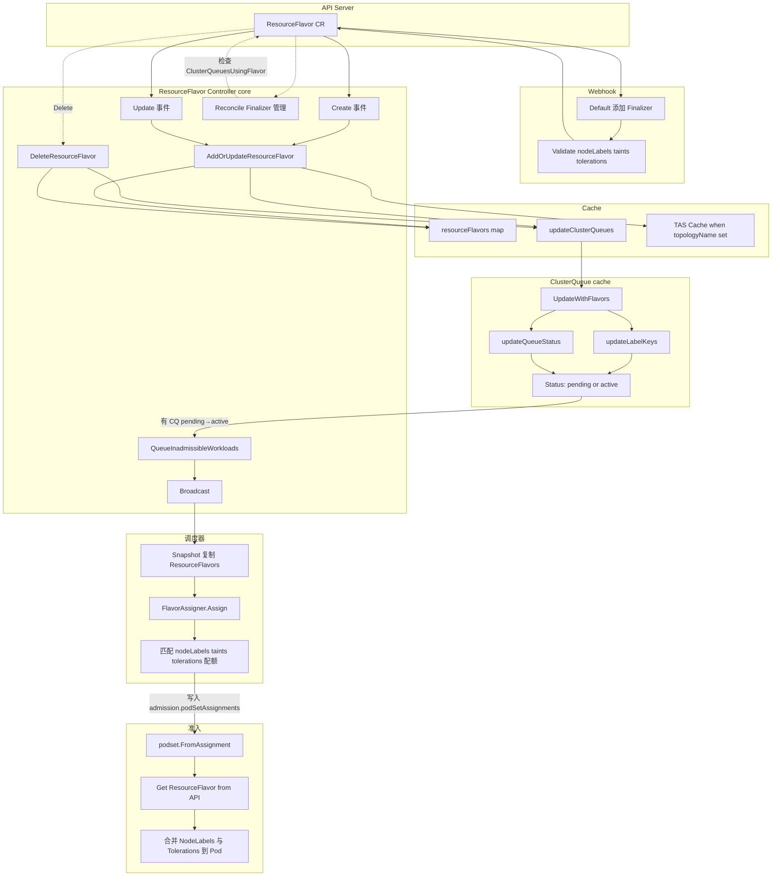
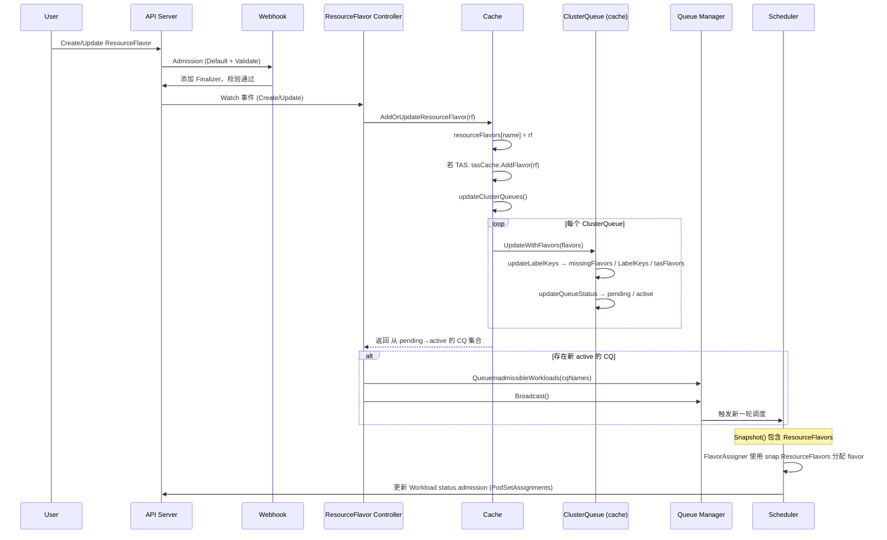
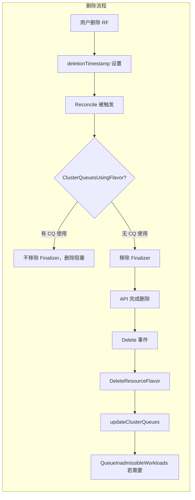

# Kueue ResourceFlavor 工作流程

本文结合源码说明 Kueue 中 **ResourceFlavor** 的完整工作流程，并给出 Markdown 格式的流程图。

---

## 一、ResourceFlavor 是什么？

**ResourceFlavor** 是 Kueue 的集群级资源（Cluster-scoped），用于描述“一类节点资源”的抽象，包括：

- **nodeLabels**：与该 flavor 关联的节点标签（用于与 Pod 的 nodeSelector/nodeAffinity 匹配）
- **nodeTaints**：该类节点上的污点
- **tolerations**：准入时自动注入到 Pod 的容忍（以便调度到带 nodeTaints 的节点）
- **topologyName**（可选）：用于拓扑感知调度 TAS

ClusterQueue 通过 **ResourceGroups[].flavors** 引用 ResourceFlavor，为队列提供“可用的资源风味”；调度器为 Workload 分配合适的 flavor，准入时再根据 flavor 把 nodeLabels/tolerations 注入到实际 Pod 上。

---

## 二、涉及的核心组件与源码位置

| 组件 | 路径 | 职责 |
|------|------|------|
| API 类型 | `apis/kueue/v1beta1/resourceflavor_types.go` | ResourceFlavor CRD 及 Spec |
| Webhook | `pkg/webhooks/resourceflavor_webhook.go` | 默认值（finalizer）、校验 |
| 核心 Controller | `pkg/controller/core/resourceflavor_controller.go` | 事件驱动 Cache 更新、Finalizer、通知 CQ |
| Cache | `pkg/cache/cache.go` | 存储 ResourceFlavor、驱动 ClusterQueue 状态 |
| ClusterQueue (cache) | `pkg/cache/clusterqueue.go` | 根据 flavors 更新 LabelKeys/状态（pending/active） |
| Snapshot | `pkg/cache/snapshot.go` | 为调度器提供 ResourceFlavors 只读快照 |
| Scheduler | `pkg/scheduler/scheduler.go` | 使用 Snapshot 中的 ResourceFlavors 做 flavor 分配 |
| FlavorAssigner | `pkg/scheduler/flavorassigner/flavorassigner.go` | 按 nodeLabels/tolerations/配额 选择 flavor |
| PodSet | `pkg/podset/podset.go` | 根据 Admission 中的 flavor 从 API 取 ResourceFlavor，合并 nodeLabels/tolerations 到 Pod |
| TAS Controller（可选） | `pkg/controller/tas/resource_flavor.go` | 拓扑 flavor 与 Node 变更时更新 cache 并触发重调度 |

---

### 2.1 PodSet 是什么？podset 包干什么用？

**PodSet（Pod 集合）** 在 Kueue 里有两层含义：

1. **API 里的 PodSet**  
   Workload 的 `spec.podSets[]` 里，每个元素是一组“同一模板、同一副本数”的 Pod。例如一个训练 Job 有 worker 和 parameter-server 两种角色，就对应两个 PodSet；每个 PodSet 有 `name`、`template`（Pod 模板）、`count`。准入结果在 `status.admission.podSetAssignments[]`，每个 PodSetAssignment 包含该 PodSet 分配到的 **flavor**（按资源类型）、count 等。

2. **podset 包（pkg/podset）**  
   这不是“一个 Pod 集合”对象，而是一个**工具包**，用来在 **“准入结果（Assignment）”** 和 **“实际 Pod 模板（NodeSelector、Tolerations 等）”** 之间做转换：

   - **PodSetInfo**：一个结构体，表示“要应用到 Pod 上的调度相关字段”的汇总：`Name`、`Count`、`Annotations`、`Labels`、`NodeSelector`、`Tolerations`、`SchedulingGates`。
   - **FromAssignment(ctx, client, assignment, defaultCount)**：根据准入结果 `PodSetAssignment` 生成 PodSetInfo。会遍历 `assignment.Flavors` 里引用的 ResourceFlavor，**从 API Server Get 对应 ResourceFlavor**，把其 `NodeLabels` merge 进 NodeSelector、把 `Tolerations` 追加进 PodSetInfo。这样“调度器选中的 flavor”就变成“要打到 Pod 上的节点选择与容忍”。
   - **FromPodSet(ps)**：从 Workload 的某个 `PodSet`（spec）里提取 Pod 模板上已有的 NodeSelector、Tolerations 等，得到 PodSetInfo。
   - **Merge**：把两个 PodSetInfo 合并（例如 FromAssignment 得到的 flavor 约束 + FromPodSet 得到的用户原有约束），冲突则报错。
   - **Merge(meta, spec, info)**：把 PodSetInfo 写回实际的 `*metav1.ObjectMeta` 和 `*corev1.PodSpec`，即更新 Pod 的 `annotations`、`labels`、`nodeSelector`、`tolerations`、`schedulingGates`。

**总结**：podset 包负责 **把 Kueue 的准入结果（尤其是 ResourceFlavor 的 nodeLabels/tolerations）安全地合并进 Job/Pod 的 Pod 模板**。这样被准入的 Workload 在真正创建 Pod 时，Pod 会带上正确的节点选择和容忍，才能调度到 ResourceFlavor 对应的节点上。各 Job 框架（Job、RayCluster、Provisioning 等）在“应用 admission”时都会用到 `podset.FromAssignment` + `podset.Merge` 这一套。

---

## 三、详细工作流程（按生命周期）

### 3.1 创建 / 更新 ResourceFlavor（API → Cache → ClusterQueue）

1. **用户创建/更新 ResourceFlavor**
   - 提交 `ResourceFlavor` 到 API Server。

2. **Webhook 处理**（`pkg/webhooks/resourceflavor_webhook.go`）
   - **Default**（Create）：若未包含 finalizer，则添加 `kueue.ResourceInUseFinalizerName`，防止正在被 ClusterQueue 使用时被删掉。
   - **ValidateCreate / ValidateUpdate**：校验 `spec.nodeLabels`、`spec.nodeTaints`、`spec.tolerations` 等。

```go
// Default - 添加 finalizer
if !controllerutil.ContainsFinalizer(rf, kueue.ResourceInUseFinalizerName) {
    controllerutil.AddFinalizer(rf, kueue.ResourceInUseFinalizerName)
}
```

3. **ResourceFlavor Controller 收到事件**（`pkg/controller/core/resourceflavor_controller.go`）
   - **Create / Update**（非删除）：
     - 调用 `r.cache.AddOrUpdateResourceFlavor(r.log, e.Object.DeepCopy())`。
     - 若返回的 `cqNames` 非空（表示有 ClusterQueue 从 pending 变为 active），则：
       - `r.qManager.QueueInadmissibleWorkloads(context.Background(), cqNames)`
       - `r.qManager.Broadcast()`，触发调度器重新评估。
   - **Reconcile**（含定序的 Reconcile 请求）：
     - 若未删除：确保 finalizer 存在（fallback，主要靠 webhook 设置）。
     - 若正在删除：若仍有 ClusterQueue 在使用该 flavor（`r.cache.ClusterQueuesUsingFlavor(flavor.Name)`），则不移除 finalizer；否则移除 finalizer，允许删除。

4. **Cache 更新**（`pkg/cache/cache.go`）
   - **AddOrUpdateResourceFlavor**：
     - 写入 `c.resourceFlavors[rf.Name] = rf`。
     - 若为 TAS flavor（`handleTASFlavor(rf)`），则 `c.tasCache.AddFlavor(rf)`。
     - 调用 `c.updateClusterQueues(log)`。
   - **updateClusterQueues**：
     - 对每个 ClusterQueue 调用 `cq.UpdateWithFlavors(log, c.resourceFlavors)`。
     - 若某 CQ 状态从 `pending` 变为 `active`，则将其加入返回的 `cqs` 集合，供上层触发 `QueueInadmissibleWorkloads` 和 `Broadcast`。

5. **ClusterQueue 内部状态更新**（`pkg/cache/clusterqueue.go`）
   - **UpdateWithFlavors(log, flavors)**：`updateLabelKeys(flavors)` + `updateQueueStatus(log)`。
   - **updateLabelKeys**：
     - 遍历每个 ResourceGroup 的 Flavors，若 flavor 存在于 `flavors` 中，则收集其 `NodeLabels` 的 key 到 `LabelKeys`，若有 `TopologyName` 则记入 `tasFlavors`；否则加入 `missingFlavors`。
   - **updateQueueStatus**：
     - 若存在 `missingFlavors`、`missingAdmissionChecks`、TAS 违规等，则 `Status = pending`，否则 `Status = active`。
     - 只有 `active` 的 ClusterQueue 才会在 Snapshot 中被用于调度。

```go
// clusterqueue.go - 决定 CQ 是否 active
status := active
if c.isStopped || len(c.missingFlavors) > 0 || len(c.missingAdmissionChecks) > 0 || ... {
    status = pending
}
```

### 3.2 删除 ResourceFlavor

1. 用户为 ResourceFlavor 设置 `deletionTimestamp`（并保留 finalizer）。
2. Controller **Reconcile**：
   - 若 `ClusterQueuesUsingFlavor(flavor.Name)` 非空，则不移除 finalizer，删除被阻塞。
   - 当没有任何 ClusterQueue 再引用该 flavor 时，移除 finalizer，对象被删除。
3. **Delete 事件**：
   - `r.cache.DeleteResourceFlavor(r.log, e.Object)`：从 `c.resourceFlavors` 删除，若为 TAS 则从 `tasCache` 删除，再 `updateClusterQueues`。
   - 若有 CQ 受影响，则 `QueueInadmissibleWorkloads`，让排队中的 workload 重新参与调度。

**ClusterQueue 与 ResourceFlavor 的联动**：ClusterQueue 的 Update/Delete 会通过 `NotifyClusterQueueUpdate` 写入 `cqUpdateCh`；ResourceFlavor Controller 的 Generic Handler 从 channel 收到“某个 CQ 变更”后，对“该 CQ 曾使用、且当前已无任何 CQ 使用”的 flavor 发起 Reconcile，从而在合适的时机移除 finalizer。

### 3.3 调度阶段：使用 Cache 中的 ResourceFlavor

1. **Snapshot**（`pkg/cache/snapshot.go`）
   - 调度周期开始时，`Cache.Snapshot(ctx)` 会复制 `c.resourceFlavors` 到 `snap.ResourceFlavors`，供调度器只读使用。

```go
// snapshot.go
maps.Copy(snap.ResourceFlavors, c.resourceFlavors)
```

2. **Scheduler 分配 flavor**（`pkg/scheduler/scheduler.go`）
   - `getInitialAssignments(log, wl, snap)` 中创建 `flavorassigner.New(wl, cq, snap.ResourceFlavors, ...)`，再调用 `flvAssigner.Assign(log, nil)`，得到每个 PodSet 每类资源的 flavor 分配。

3. **FlavorAssigner 匹配规则**（`pkg/scheduler/flavorassigner/flavorassigner.go`）
   - 对 ClusterQueue 中每个 ResourceGroup 的每个 flavor，从 `resourceFlavors` 中取出对应 `ResourceFlavor`：
     - 检查 Pod 的 tolerations + flavor 的 tolerations 能否覆盖 flavor 的 **nodeTaints**（NoSchedule/NoExecute）。
     - 用 flavor 的 **nodeLabels** 构造“虚拟 Node”，检查是否满足 Pod 的 nodeSelector/nodeAffinity（`selector.Match`）。
     - 再结合配额、预占等决定是否选用该 flavor 或尝试下一个。

```go
// flavorassigner.go - 使用 cache 中的 ResourceFlavor
flavor, exist := a.resourceFlavors[fName]
// ...
taint, untolerated := corev1helpers.FindMatchingUntoleratedTaint(flavor.Spec.NodeTaints, append(podSpec.Tolerations, flavor.Spec.Tolerations...), ...)
if match, err := selector.Match(&corev1.Node{ObjectMeta: metav1.ObjectMeta{Labels: flavor.Spec.NodeLabels}}); !match || err != nil { ... }
```

### 3.4 准入阶段：把 ResourceFlavor 应用到 Pod

Workload 被准入时，`status.admission.podSetAssignments` 中会带有每个资源类型的 flavor 引用。真正更新 Job/Pod 模板时（例如 Job 框架、Provisioning 等）：

1. 使用 **podset.FromAssignment**（`pkg/podset/podset.go`）
   - 根据 `assignment.Flavors` 中的 flavor 名称，**从 API Server 再次 Get ResourceFlavor**（不是从 cache）。
   - 将每个 flavor 的 `NodeLabels` merge 到 `NodeSelector`，将 `Tolerations` 追加到 Pod 的 tolerations。
   - 再通过 `Merge` 合并到实际 Pod 模板，从而把“分配给该 PodSet 的 flavor”落实到节点选择与容忍上。

```go
// podset.go - 准入时从 API 拉取 ResourceFlavor 并合并到 Pod
for _, flvRef := range assignment.Flavors {
    flv := kueue.ResourceFlavor{}
    if err := client.Get(ctx, types.NamespacedName{Name: string(flvRef)}, &flv); err != nil { ... }
    info.NodeSelector = utilmaps.MergeKeepFirst(info.NodeSelector, flv.Spec.NodeLabels)
    info.Tolerations = append(info.Tolerations, flv.Spec.Tolerations...)
}
```

---

## 四、TAS（拓扑感知调度）中的 ResourceFlavor

- 若 ResourceFlavor 设置了 **spec.topologyName**，则视为 TAS flavor。
- **Cache**：`AddOrUpdateResourceFlavor` 时会 `c.tasCache.AddFlavor(rf)`；删除时从 `tasCache` 删除。
- **TAS ResourceFlavor Controller**（`pkg/controller/tas/resource_flavor.go`）：
  - Watch ResourceFlavor 与 Node。Node 变更时，对受影响的 TAS flavor 发起 Reconcile。
  - Reconcile 时若存在 TAS flavor，会调用 `QueueInadmissibleWorkloads`，让之前因拓扑/节点不可用而不可准入的 workload 重新被调度评估。

---

## 五、Markdown 流程图（Mermaid）

### 5.1 ResourceFlavor 从创建到参与调度的整体流程



### 5.2 ResourceFlavor 事件与 Cache/ClusterQueue 状态流



### 5.3 删除 ResourceFlavor 与 Finalizer



---

## 六、小结

- **ResourceFlavor** 在 API 层由 Webhook 设置 finalizer 并做校验；在控制面由 **ResourceFlavor Controller** 监听增删改，同步到 **Cache** 的 `resourceFlavors`（及 TAS 的 tasCache）。
- **Cache** 通过 **updateClusterQueues** 驱动每个 **ClusterQueue** 的 **UpdateWithFlavors**，从而更新 `missingFlavors` / `LabelKeys` / `tasFlavors` 和 **pending/active** 状态；有 CQ 从 pending 变为 active 时，会 **QueueInadmissibleWorkloads** 并 **Broadcast**，触发调度。
- **调度器** 使用 **Snapshot** 中的 **ResourceFlavors** 只读副本，在 **FlavorAssigner** 中按 nodeLabels、nodeTaints/tolerations 和配额为 Workload 分配 flavor，结果写入 **admission.podSetAssignments**。
- **准入** 时通过 **podset.FromAssignment** 从 API 再次读取 **ResourceFlavor**，将 **NodeLabels** 和 **Tolerations** 合并到 Pod 模板，完成从“队列抽象 flavor”到“实际 Pod 调度约束”的落地。

上述流程与源码对应关系已在各小节中标明，便于在仓库中精确定位与阅读。
