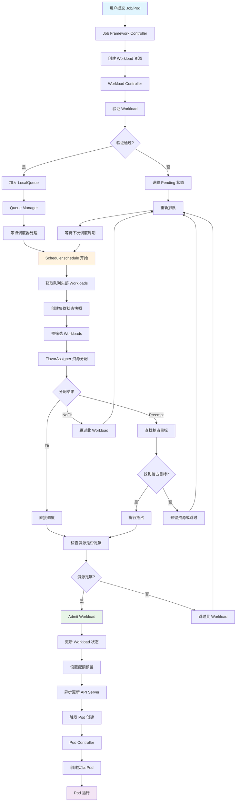

# Kueue 调度全流程

## 调度流程图

## 详细流程说明

### 1. 工作负载提交阶段

- **用户提交**: 用户通过 kubectl 或其他方式提交 Job、Pod 等资源
- **Job Framework Controller**: 各种 Job 框架的控制器（如 Job Controller、Pod Controller 等）监听资源变化
- **创建 Workload**: 控制器将 Job/Pod 转换为 Kueue 的 Workload 资源

### 2. 工作负载验证阶段

- **Workload Controller**: 核心控制器验证 Workload 的有效性
- **验证项目**:
  - 命名空间标签是否匹配 ClusterQueue 选择器
  - 资源请求是否有效
  - LimitRange 约束是否满足
  - 准入检查是否通过

### 3. 队列管理阶段

- **LocalQueue**: 工作负载被加入到指定的本地队列
- **Queue Manager**: 管理队列状态，维护工作负载的排队顺序
- **等待调度**: 工作负载在队列中等待调度器处理

### 4. 调度器核心流程

#### 4.1 调度周期开始

- **获取队列头部**: 从各个队列获取等待调度的头部工作负载
- **创建快照**: 创建集群资源状态的一致性快照，包含：
  - ClusterQueue 状态
  - Cohort 状态  
  - ResourceFlavor 状态
  - 当前资源使用情况

#### 4.2 预筛选阶段

- **基础检查**: 验证工作负载的基本条件
- **FlavorAssigner**: 为工作负载分配具体的资源 flavor
- **分配模式**:
  - **Fit**: 有足够资源直接调度
  - **Preempt**: 需要抢占其他工作负载
  - **NoFit**: 无法分配资源

#### 4.3 资源分配策略

- **直接调度**: 如果资源充足，直接分配
- **抢占调度**: 如果资源不足但可以抢占，查找抢占目标
- **资源预留**: 对于需要抢占但暂时无法执行的情况，预留资源

#### 4.4 抢占机制

- **抢占目标查找**: 根据优先级和策略查找可抢占的工作负载
- **抢占执行**: 驱逐低优先级工作负载，释放资源
- **抢占策略**: 支持经典抢占和公平共享抢占

### 5. 工作负载准入阶段

- **资源检查**: 最终确认资源是否足够
- **状态更新**: 更新工作负载状态为 Admitted
- **配额预留**: 在 ClusterQueue 中预留资源配额
- **异步更新**: 异步更新 API Server 中的工作负载状态

### 6. Pod 创建阶段

- **触发创建**: 工作负载准入后触发 Pod 创建
- **Pod Controller**: 创建实际的 Pod 资源
- **Pod 运行**: Pod 在集群中开始运行

### 7. 重新排队机制

- **调度失败**: 如果工作负载无法调度，重新加入队列
- **等待重试**: 等待下一个调度周期重新尝试
- **状态更新**: 更新工作负载状态为 Pending

## 关键组件说明

### Scheduler

- 核心调度器，负责整个调度流程的协调
- 维护调度周期和状态快照
- 处理工作负载的准入和重新排队

### Queue Manager  

- 管理本地队列和集群队列
- 维护工作负载的排队顺序
- 处理队列的头部工作负载获取

### Cache

- 维护集群资源状态的缓存
- 提供一致性的资源快照
- 跟踪资源使用情况和可用性

### FlavorAssigner

- 负责资源 flavor 的分配
- 处理资源借用和抢占逻辑
- 支持拓扑感知调度

### Preemptor

- 处理工作负载抢占逻辑
- 支持多种抢占策略
- 管理抢占目标的查找和执行

## 调度策略

### 优先级排序

1. 已有配额预留的工作负载优先
2. 不需要借用资源的工作负载优先  
3. 高优先级工作负载优先（如果启用）
4. FIFO 顺序（按创建或驱逐时间）

### 公平共享

- 支持公平共享调度策略
- 基于主导资源份额进行排序
- 确保资源在不同队列间公平分配

### 拓扑感知调度

- 支持节点拓扑约束
- 考虑节点亲和性和反亲和性
- 优化工作负载的节点分配
